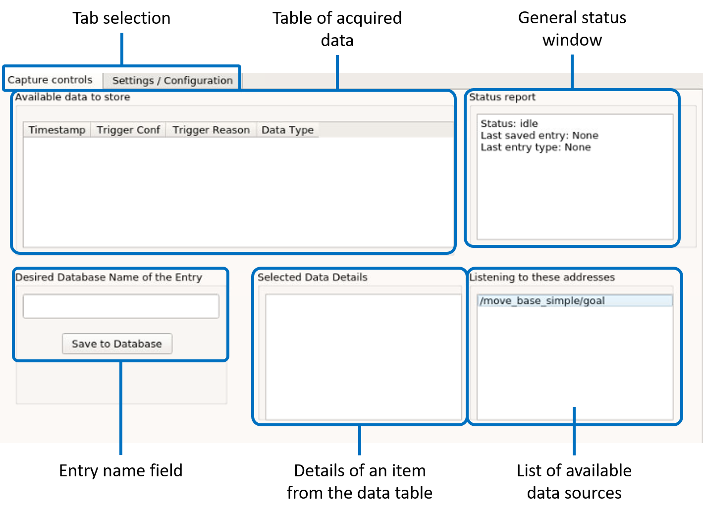
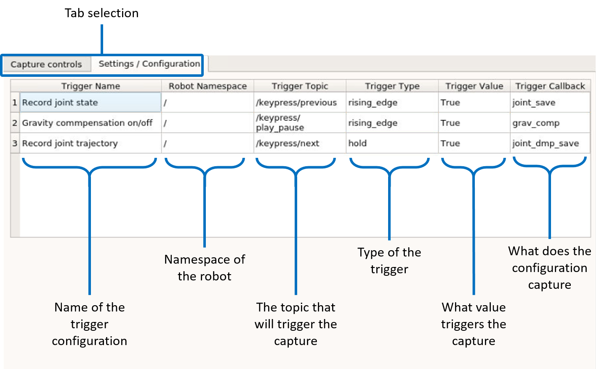

Kinesthetic guidance
======

The definition of robot motions to carry out disassembly procedures can be a difficult and time consuming process even for experts, let alone non-expert users. Programming by Demonstration (PbD) provides a methodology to define such motions in a natural way rather than by coding complex programs in a robot programming language. In ReconCycle, PbD is based on kinesthetic guidance, which enables the user to move the robot through its workspace by physically guiding it along the desired path. Kinesthetic guidance is best implemented on robots with torque sensors in each joint, such as the Franka Emika Panda manipulator arms utilized in ReconCycle. By utilizing the torque sensors and a model of the robot's dynamics, the robot control system can compensate for the effects of gravity. Thus the demonstrator can focus on task demonstration without needing to overcome also the robot's weight and the friction in its joints.

Compared to traditional robot programming approaches where the robot operator uses the so called teaching-pendant, kinesthetic guidance is much simpler to use. However, it comes with a drawback -- lack of an interface to move and store the taught poses. To overcome this drawback, we developed a graphical user interface (GUI) to help users storing said skills into the MongoDB database. We named it Helping Hand. 

This user interface runs on a computer connected to the ROS network so it has access to all that is being broadcast on the network, including robot joint configurations and poses of their tool center point (TCP). This GUI is used to store either single configurations (joint or Cartesian space) or whole trajectories encoded as DMPs (joint or Cartesian space) as named entries into the database. 

The GUI has two main tabs: "Capture controls" and "Settings/Configuration". The first is used during the kinesthetic teaching process to store data into the database, while the second is used to configure the GUI itself. 

The *Capture controls*: this tab is composed of the following fields:

- **Available data to store** -- when a user triggers a signal defined in the GUI's configuration, the current robot posture (joint and Cartesian space) are saved in a temporary buffer and displayed in this field.
- **Status report** -- this field is used to display some basic status information of the robot and the GUI.
- **Desired Database Name of the Entry** -- to store some data into the database, the user writes the name under which the entry should be saved into the database, selects the single data entity from the "Available data to store" fields, and then clicks on the "Save to Database" button.
- **Selected Data Details** -- Before saving the data into the database, the user can inspect the data details. These details are displayed for the data selected from the "Available data to store" field.
- **Listening to these addresses** -- The topics displayed in this field inform the user which robot status is available to be recorded.

Figure below shows the *Settings/Configuration* tab. 

It presents the current configuration of the GUI:

- **Trigger Name** -- The name of the configuration for the specific trigger.
- **Robot Namespace** -- The namespace of the robot for the specific trigger.
- **Trigger Topic** -- The name of the ROS topic (of the type `std_msgs/Bool`). Upon triggering it signals the GUI to save the data into the aforementioned temporary buffer.
- **Trigger Type** -- The type of the trigger, this can be either `rising_edge`, `falling_edge`, or `hold`.
- **Trigger Callback** -- The storing function that is executed when a trigger is detected.

The configuration is loaded when the GUI is started. It is read from a YAML file.
