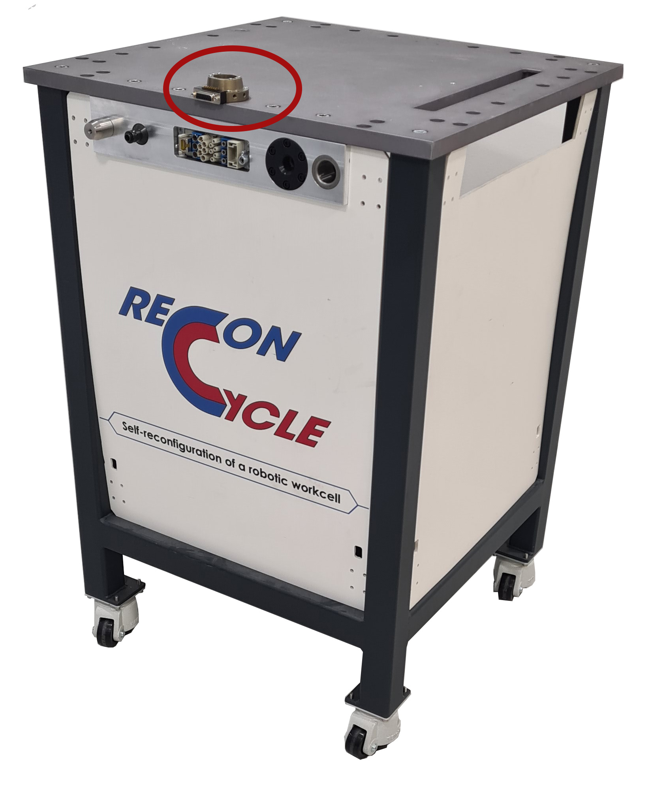

# Hardware

## Modular robotic platform 


The ReconCycle robotic workcell has been designed as a modular platform, which can be used
for building fully modular robotic workcells. A functional robotic workcell consists of several
interconnected modules, each of them augmented with its own specialized equipment to achieve
full functionality.



```{toctree}
:maxdepth: 2

archetypical_module
pnp
modules
soft_actuators
```
