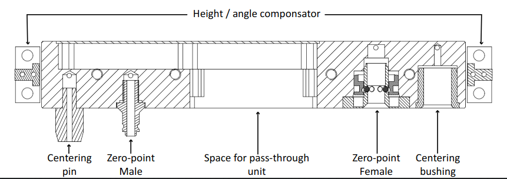

### ReconCycle Plug-and-Produce (PnP) Connector 

The PnP connector has a universal shape, eliminating the need for male and female variants. This design significantly enhances flexibility and ease of use. The connector features a single-piece CNC-machined aluminum body, providing rigidity and housing all other components. Centering pins and bushings ensure proper alignment of the connector pair before final coupling.

Custom zero-point clamping units achieve the final mechanical coupling, ensuring a secure and repeatable connection. The zero-point system does not require any unlocking action before coupling. The connectors snap together with a simple push, without the need for additional control or actuation.

The PnP connector includes a power and data pass-through unit, enabling all modules in the cell to share power and adata. This is accomplished using a commercially available modular connector unit, which can be assembled according to individual requirements and provides pass-through for electrical power, network cables, and pneumatic lines.

The design includes a height compensation unit that can correct height alignment errors of up to ±15mm and angular alignment errors of up to ±5°. To use this feature effectively, modules must be equipped with a calibration system.

#### Usage Instructions
To connect the PnP Connector, ensure both connectors are clean and free from debris. Align the connectors using the centering pins and bushings. Push the connectors together with some force until the zero-point clamping units lock into place.

For the power and data setup, connect the power and data cables to the modular connector unit according to your specific requirements. Verify that all connections are secure and properly aligned.

If needed, use the height compensation unit to correct any alignment errors. Ensure that the modules are equipped with the necessary calibration system to make precise adjustments.

To disconnect, apply pneumatic pressure to the release port of the zero-point female connector to dissengage the locking mechanism and pull the modules apart.

#### Maintenance
Regularly inspect the connectors for wear and tear. Clean the connectors to ensure optimal performance and longevity. If any part of the connector is damaged, replace it immediately to maintain system integrity.

By following these instructions, you can ensure efficient, reliable, and flexible operation of your ReconCycle system, meeting the demands of diverse and changing production requirements.
