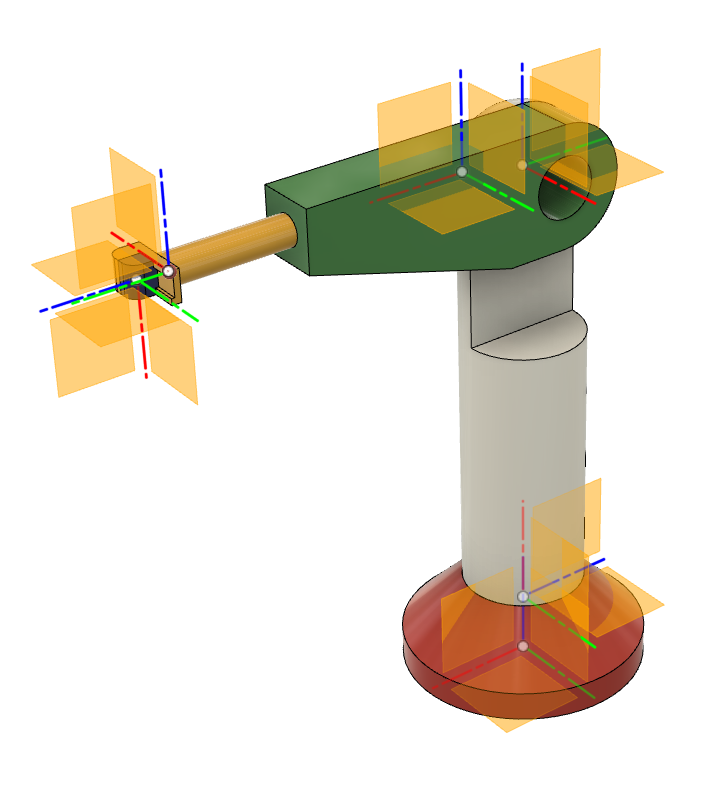
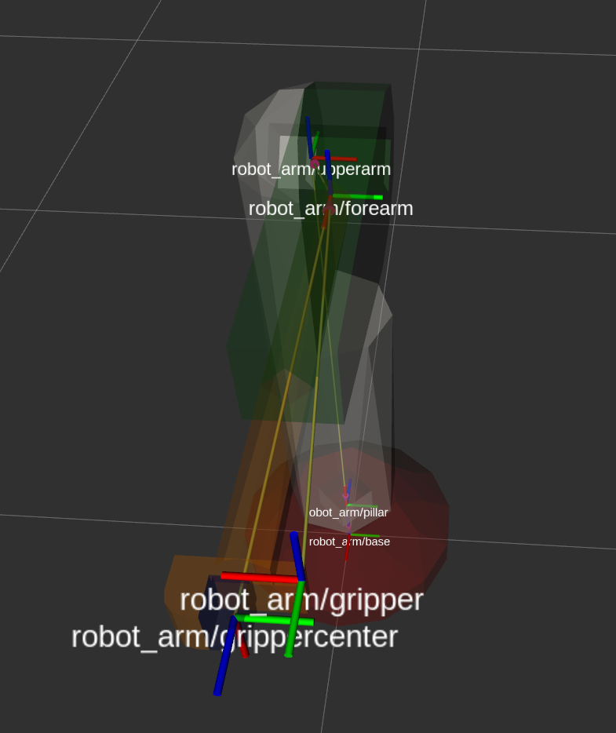
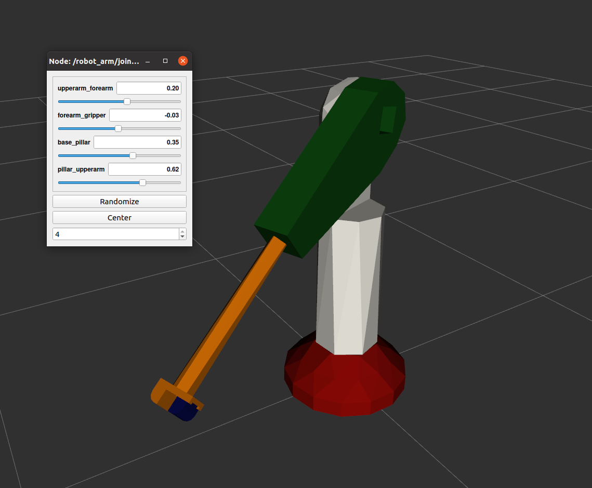
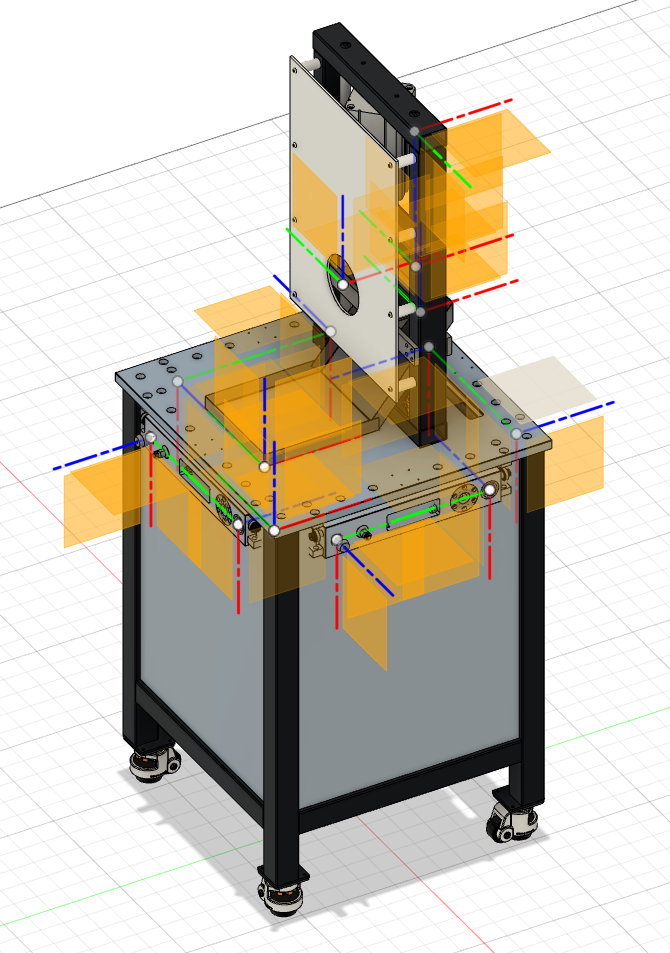
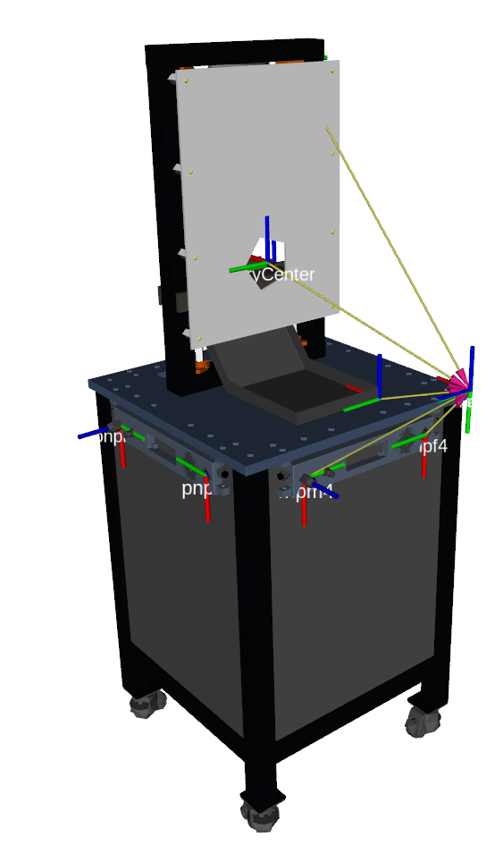
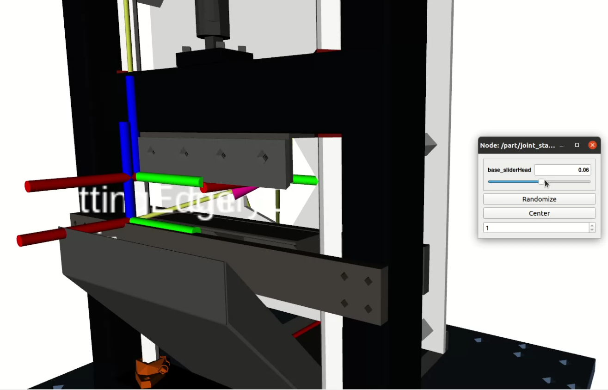

URDF from STEP
===================================

https://github.com/ReconCycle/urdf_from_step

This is ROS package for automated conversion of STEP models to URDF format. 
The program takes as input the STEP file (left images) of the desired robot or robot-like maschine and creates a new ROS package. 
The package created contains the URDF description, the STL mesh files required by URDF description, and the ROS launch file to load the data into the ROS for visualization (center images) and control (right images).

Simple robot arm:

Cutter module from Reconcycle project:

.. note::

   This project is under active development.

.. toctree::
   :maxdepth: 2

   converting_with_ros
   instalation
   creating_step_file
   examples

   