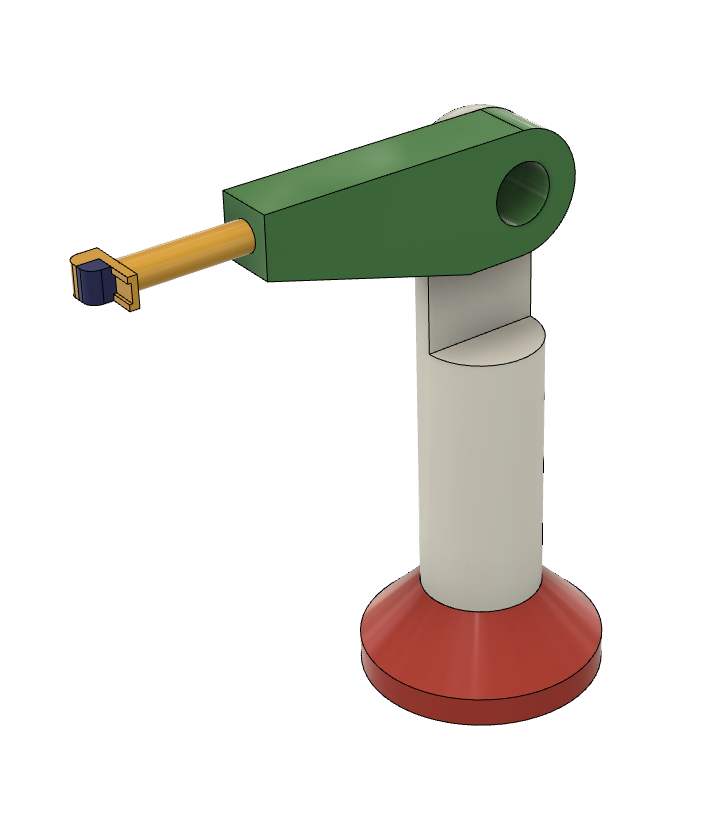
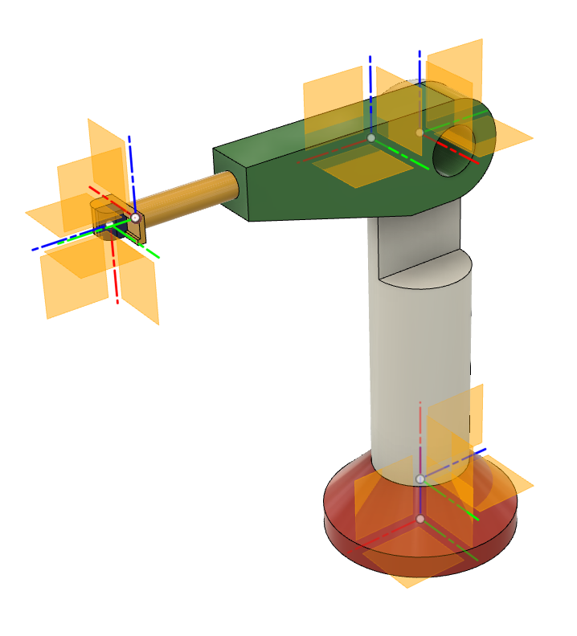
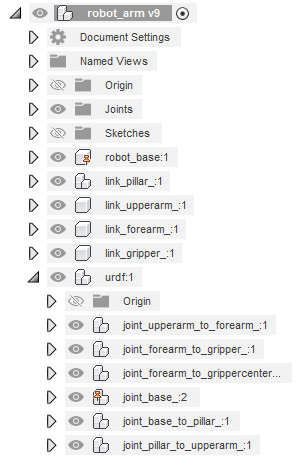
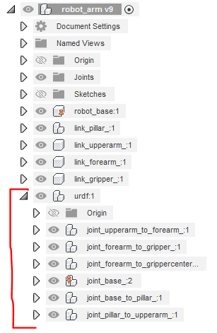
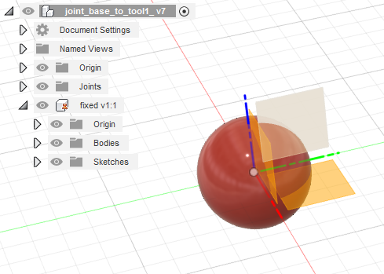
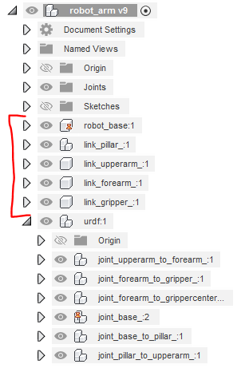

Step file creation
=====

Creation of urdf from step file with program `urdf_from_step <https://github.com/ReconCycle/urdf_from_step>`_ is possible by adding properly named parts representing joints coordinates systems (right) to the robot shape CAD file (left). The addition of joint definitions is possible in any CAD software. Definitions can be added to the robot shape in CAD program-specific native format or to the robot shape already in step file format. For this example, we used Fusion 360 as a CAD program.

This tutorial uses the example of a simple `robot arm <https://github.com/ReconCycle/urdf-from-step-examples/tree/main/examples/robot_arm/input_step_files>`_. 

Joint and link definitons
-----------------
In urdf the kinematic chain is defined with links and joints between them. To create the kinematic tree in a CAD model that can be later converted to the urdf kinematic chain, we need to add additional "definition" elements to our initial robot CAD shape elements. The basis for this is the definition of the joints tree structure in the robot CAD model. Each separate joint in the later urdf kinematic is represented with a separate CAD element, and the later urdf kinematic links between these joints are created from the initial relations between the CAD joints elements.

All joints "description" CAD elements need to be in the subassembly with the name "urdf*" or "URDF*". This subassembly needs to be created on the top level of the CAD tree, like in the image:

Each created joint CAD element needs to be named "joint_PARENT_to_CHILD_*". Where "joint_" and "_to_" are joint tags and "PARENT" and "CHILD" are urdf links names of your choice, that the defined joint is connecting. As per convention "\*"  after the last underscore can be substituted with anything. Special joint definitions "joint_base_*" also need to be added, that mark the origin of the whole urdf coordinate system and root of the kinematic tree.

Joint definitions define the urdf kinematics chains by defining a child from the previous joint as a parent in the next one. The chain of definitions should start with the link "base" from "joint_base_*" and be unbroken to the end nodes. The kinematic tree can be branched to different end nodes.

Joint definition CAD element
-----------------

The joint definition CAD element needs to be created as the subassembly as the name of the part inside the joint subassembly defines the joint type. Currently following three joint types are supported fixed, revolute, and prismatic with corresponding parts names "fixed*", "revolute*" and "prismatic*".

The coordinate system of the subpart represents the joint coordinate system in urdf definitions. In the case of the revolute and prismatic axis, the x-axis is the rotation axis or the direction of translational movement.

The shape in the joint subassembly is saved to the STEP file but it is later ignored in the urdf creation, so any user may choose his own desired shapes inside of joints definitions. Because the Fusion 360 doesn't want to save the part with no shape to the STEP file we added the ball shape to the part representing the joint type. 

We created one CAD joint definition that we mated as an independent copy for all our joint definitions. For each copy, we changed the subassembly name to the required link names that it was connecting and we changed the internal part name to the joint type that it was representing. 

Link shapes definitions
-----------------

Kinematic links for urdf are automatically created from the joint element relations. Using the 'definition' link element, we connect different parts of our initial robot CAD shape to corespoding links.

This is done with proper naming of subassemblies or parts, with template naming convection "link_LINKNAME_*", where "link_" is the definition identifier and "LINKNAME" is connecting specific shapes to the links. The definition element can be at any level of the CAD tree hierarchy, as long as it is not inside another definition assembly. All "LINKNAME" must have a pair in the urdf definition "CHILD". A kinematic link that "CHILD" does not have any "link_CHILD" counterpart  is also possible, it will have only kinematic definition and no geometric shapes. The shapes that are not hierarchical in any "link_" definition are automatically added to the URDF base link.

..
   [//]: # "STL also exported automatic"

..
   Colors..
<<<<<<< HEAD
=======

>>>>>>> 2cdedc8... one image
