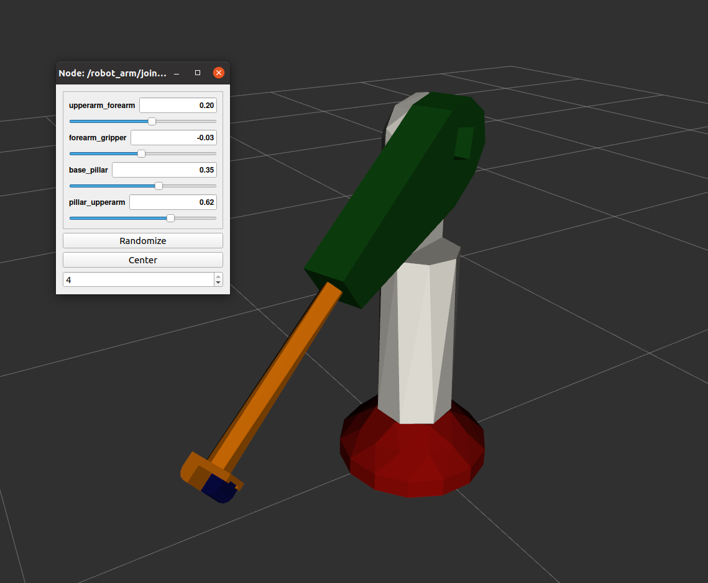

URDF from STEP
===================================

This is documentation of ROS package `urdf_from_step <https://github.com/ReconCycle/urdf_from_step>`_, for automated conversion of STEP models to URDF format. 
The program takes as input the STEP file (left images) of the desired robot or robot-like maschine and creates a new ROS package. 
The package created contains the URDF description, the STL mesh files required by URDF description, and the ROS launch file to load the data into the ROS for visualization (center images) and control (right images).

Both examples from the figures below are available in the following `repository <https://github.com/ReconCycle/urdf-from-step-examples>`_. 

Simple robot arm:

.. image:: figures_creating_step/robot_arm_cad_with_cs.PNG
   :width: 200px

.. image:: figures_rviz/rviz_tf_center.png
   :width: 200px

Cutter module from Reconcycle project:

.. image:: figures_reconcycle/cad_cs_gilotina.png
   :width: 200px

.. image:: figures_reconcycle/gilotina2.png
   :width: 300px

Working principle
-------------

The URDF file is generated in the following steps. First, the STEP file is loaded and its contents are analyzed using tools from the Open Cascade Technology (OCCT) library [1]_. The analysis looks for keywords such as "joint" and "link" in the part names or in the assembly names in the model design tree. The instances with these keywords in their names represent the corresponding "joint" and "link" building blocks of URDF. The remaining part names containing the keyword encode the connections between individual URDF elements and their names in the URDF file. Once these instances and their connections have been identified, the correct local transformation between them must be computed from the values of their base coordinate systems in the STEP file. The calculated local transformations are transformed accordingly into the coordinate system values of the "joint" and "link" URDF definitions. The instances that do not have keywords in their names represent geometric shapes. They are transformed into the STL mesh specified in the appropriate local coordinate system according to the given URDF tree structure. From the collected and computed URDF data, the XML in URDF format is created using the urdfdom parser library. Finally, everything is stored in a newly created ROS package.

.. note::

   This project is under active development.

References
------------

.. [1] pythonocc: Thomas Paviot. (2022). pythonocc (7.7.0). Zenodo. `https://doi.org/10.5281/zenodo.3605364 <https://doi.org/10.5281/zenodo.3605364>`_

.. toctree::
   :maxdepth: 2

   instalation
   converting_with_ros
   creating_step_file
   urdf_rviz
   devel_guide
   

   