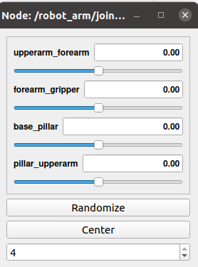
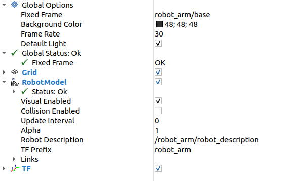
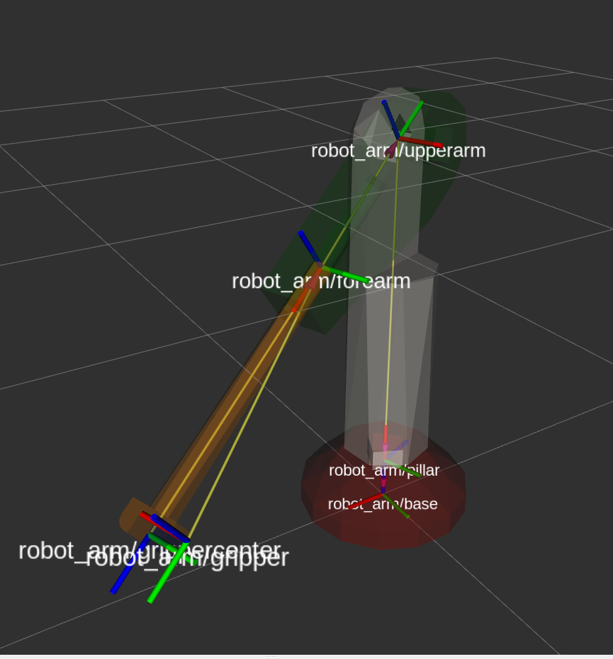
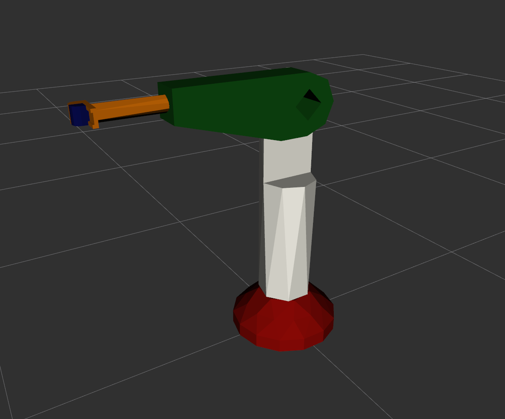

Conversion process manual
=========================

The conversion of a STEP file into a URDF package is demonstrated using a simple `robot arm <https://github.com/ReconCycle/urdf-from-step-examples/tree/main/examples/robot_arm/input_step_files>`_ and Docker.

Environment preparation
-----------------------

First, we need to download the docker image:

.. code-block:: bash

    docker pull ghcr.io/reconcycle/urdf-from-step:latest

Then we download the sample case, prepare two folders for later mounting with Docker and copy the sample step file into the first folder:

.. code-block:: bash

    git clone https://github.com/ReconCycle/urdf-from-step-examples.git
    mkdir input_step_files
    mkdir output_ros_urdf_packages
    cp urdf-from-step-examples/examples/robot_arm/input_step_files/robot_arm.step input_step_files/
    

Conversion
------------

The prepared step file is converted to the corresponding ROS package containing URDF with the following Docker command:

.. code-block:: bash

    docker run  -v ~/input_step_files:/input_step_files -v ~/output_ros_urdf_packages:/output_ros_urdf_packages  --rm ghcr.io/reconcycle/urdf-from-step:latest roslaunch urdf_from_step build_urdf_from_step.launch step_file_path:="/input_step_files/robot_arm.step" urdf_package_name:="robot_arm"
 
 
It is normal for the node to die after execution: REQUIRED process [urdf_creator-2] has died! process has finished cleanly

Run created package
----------------------

To run the created package, you can use an existing catkin workspace or create a new one. The built package must be copied to the src folder in the Docker mount output folder. Once built and sourced, the package can be run:

.. code-block:: bash

    mkdir -p ~/ros_ws/src
    cp -r ~/output_ros_urdf_packages/robot_arm ~/ros_ws/src/robot_arm
    cd ros_ws
    catkin build robot_arm
    source devel/setup.bash
    roslaunch robot_arm load_urdf.launch

On startup, the joint state publisher GUI is displayed:

Visualization
-------------

Run ros visualization tool:

.. code-block:: bash

    rviz

Setup rviz visulaization settings:

.. image:: figures_rviz/rviz_tf_center.png
   :width: 350px

.. image:: figures_rviz/rviz_moved.png
   :width: 350px

