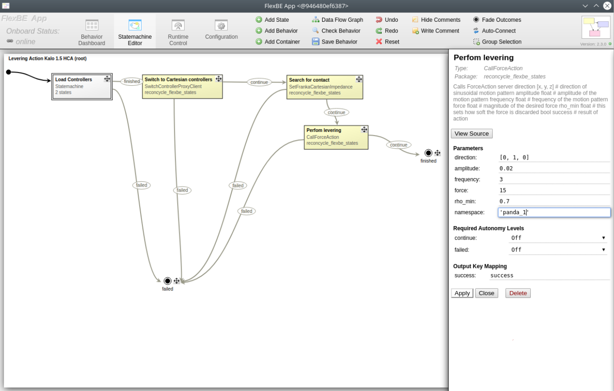

# FlexBE behavior engine

Dissasembly operations and other functionalities required during the disassembly process (e.g. tool changing, vision system control) are encapsulated within FlexBE states, which are then executed using a FlexBE behavior engine. In this way all commonly used actions that are required during a dissasembly can be packaged into separate parametrized states that have a certain input and output.

## FlexBE states

Internally, each FlexBE state is structured as a set of methods that define its lifecycle. After all states have been initialized, the *start* event is triggered in all states. Throughout the execution process, the behavior engine invokes the `on_enter`, `execute`, and `on_exit` methods for each state along the execution path.

- The constructor of a state is invoked during the initialization of the overall state machine to establish the state's interfaces.
- `on_start`: This method is executed for each state when the behavior starts. This event is ideally used for the initialization of different parameters and is triggered exactly once for each state per behavior execution.
- `on_enter`: Executed when transitioning into the state, this method prepares the state for execution.
- `execute`: This method is repeatedly called while the state is active. Its primary purpose is to monitor state conditions and determine suitable outcomes. If no outcome is returned, the state remains active.
- `on_exit`: This method is invoked when transitioning out of the state. It is used to clean up resources or to perform any necessary final actions before the state is deactivated.
- `on_stop`: Called if the state is stopped prematurely, this method ensures proper resource deallocation and handles any special considerations for abrupt termination.

## Example use of FlexBE states

A set of predefined FlexBE states is available at the [ReconCycle GitHub repository](https://github.com/ReconCycle/reconcycle_flexbe/tree/main/reconcycle_flexbe_states/src/reconcycle_flexbe_states) and includes states for Cartesian and joint robot motions, gripper control, vision system control, and others.

Image below shows how the user interface of FlexBE App can be used to add desired states into behavior. The states can be connected to form a state machine. Each state has input parameters that are used at state initilization, input keys that are used as state input at runtime, and output keys that define the result of an executed state.

