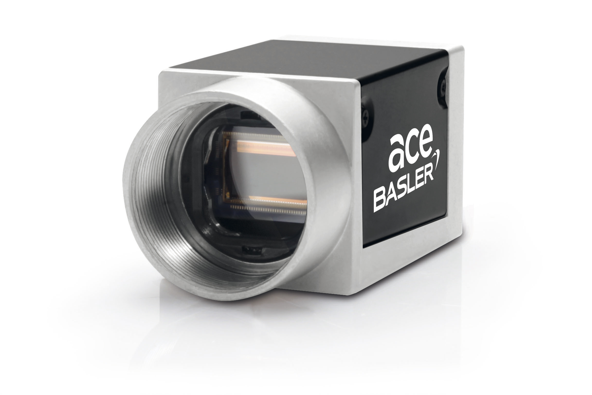

# Basler Camera



ros-basler: Docker [pylon-ROS-camera](https://github.com/basler/pylon-ros-camera)

Basler provides an official [pylon ROS driver](https://github.com/basler/pylon-ros-camera) for Basler GigE Vision and USB3 Vision cameras. This project provides a docker wrapper for it with the extra addition of:
```bash
pylon_colour_camera_node.launch
```
that creates a colour node when using `yuv422` image encoding.

**For this installation you will require [Docker](https://docs.docker.com/engine/install/ubuntu/) and [docker compose](https://docs.docker.com/compose/install/linux/#install-using-the-repository)** (click the links for instalation instructions)

## Getting Started

First you need to clone [ros-basler](https://github.com/ReconCycle/ros-basler) into your work directory with:

```bash
git clone https://github.com/ReconCycle/ros-basler.git
```
Navigate into the newly created 'ros-basler' directory

Run the container with:
```bash
docker-compose up -d
```
This will build the container first.

In the `docker-compose.yml` file, the important line is:
```yaml
command: roslaunch pylon_camera pylon_colour_camera_node.launch
```

## Camera Setup

In UserSet2 specify the following:

- binning 2
- output resolution (after binning) 1450 x 1450
- center x and y

## Camera Calibration

The [pylon ROS driver](https://github.com/basler/pylon-ros-camera) can accept a camera calibration file containing the intrinsic parameters.

**VERY IMPORTANT** Before the next command, run `xhost +` on the client in order to be able to see the GUI.

Access the container with:
```bash
docker exec -it ros-basler bash
```

1. To run the calibration you will need a calibration checkerboard, you will need to specify the checkerboard parameters:
 - number of squares (width X height)
 - dimensions of the squares in metres (example: 20,1 mm is 0,0201 m)

To run the calibration on a 10x7 checkerboard with 20.1mm squares:
```bash
rosrun camera_calibration cameracalibrator.py --size 10x7 --square 0.0201 image:=/basler/image_color camera:=/basler
```
[Read the docs for further info](http://wiki.ros.org/camera_calibration).

2. Save the calibration and copy the yaml file from the calibrationdata.tgz

3. paste the calibration in `ros-basler/config/`

4. In `config/colour_camera.yaml` point it to the calibration file by adding the absolute path to the file to the `camera_info_url:` line, like in this example:
```yaml
camera_info_url: "file:///root/catkin_ws/src/pylon-ros-camera/pylon_camera/config/calibration_2900x2900_goe.yaml"
```

## Extra

To save an image to a file, run:
```bash
rosrun image_view image_saver image:=/basler/image_color
```
This will save the latest image message on the listed topic as an image file in the curent directory


## Debugging

For debugging the docker container we don't want the camera node to launch, to prevent thet from happending we need to comment out the `command:` line in the  `docker-compose.yml` file:
```yaml
    network_mode: host # workaround to use the camera
    restart: "no"
    volumes:
      - config:/root/catkin_ws/src/pylon-ros-camera/pylon_camera/config
      - launch:/root/catkin_ws/src/pylon-ros-camera/pylon_camera/launch
      - /tmp/.X11-unix:/tmp/.X11-unix # for using local xserver
--> command: bash -c "(sleep 5 && rosservice call /basler/set_sleeping True) & roslaunch pylon_camera pylon_colour_camera_node.launch"
    privileged: true
```

Enter the container with:
```bash
docker exec -it ros-basler-camera /bin/bash
```

Start the driver with:
```bash
roslaunch pylon_camera pylon_colour_camera_node.launch
```
or
```bash
roslaunch pylon_camera pylon_camera_node.launch
```

GigE Cameras IP Configuration can be done using the command:
```bash
roslaunch pylon_camera pylon_camera_ip_configuration.launch
```

## Notes


```xml
<node ns="pylon_camera_node" name="rgb_converter" pkg="image_proc" type="image_proc" >
</node>

<!-- rotate the image -->
<node ns="basler" name="image_rotator" pkg="image_rotate" type="image_rotate" >
    <param name="target_frame_id" value="" />
    <param name="target_x" value="0.0" />
    <param name="target_y" value="1.0" />
    <param name="target_z" value="0.0" />

    <param name="source_x" value="0.0" />
    <param name="source_y" value="-1.0" />
    <param name="source_z" value="0.0" />
    <remap from="image" to="/basler/image_rect_color" />
    <remap from="rotated/image" to="image_rotated" />
</node> -->

<!-- Adds a new node called image_resizer/image -->
<!-- in the remap, the to="..." should be the actual topic we want to subscribe to -->
<node pkg="nodelet" type="nodelet" name="image_resizer" args="standalone image_proc/resize">
    <param name="scale_width" type="double" value="0.5"/>
    <param name="scale_height" type="double" value="0.5"/>
    
    <remap from="image" to="/pylon_camera_node/image_color" />
    <remap from="camera_info" to="/pylon_camera_node/camera_info" />
</node>
```

## Implementation Specific Notes

The Basler camera we are using is: [Basler acA4600-7gc](https://www.baslerweb.com/en/products/cameras/area-scan-cameras/ace/aca4600-7gc).

The camera lens we are using is: [C125-0418-5M-P f4mm](https://www.baslerweb.com/en/products/vision-components/lenses/basler-lens-c125-0418-5m-p-f4mm/).
The f4mm lens has an approximate effective focal length of 23mm.

In Göttingen we have the lens mounted **67cm** above the work surface. This allows us to capture the entire work surface in the image.  Göttingen also has the [f25mm lens](https://www.baslerweb.com/en/products/vision-components/lenses/basler-lens-c125-2522-5m-p-f25mm/) from Basler. All compatible lenses can be [found here](https://www.baslerweb.com/en/products/vision-components/lenses/#series=baslerace;model=aca46007gc). The f25mm lens has an approximate effective focal length of 150mm. This means that when mounted above the table at 67cm only a small part of the work surface is in the image.

1. Download and install the Pylon camera software suite.
 Link: [pylon 6.1.1 Camera Software Suite Linux x86 (64 Bit) - Debian Installer Package](https://www.baslerweb.com/de/vertrieb-support/downloads/downloads-software/#type=pylonsoftware;language=all;version=all;os=linuxx8664bit)

2. To connect to the Basler camera over ethernet, create a new ethernet profile with settings:

- IPv4 Method: Manual
- Address: 192.168.1.200
- Netmask: 255.255.255.0
- Gateway: 192.168.1.1

3. Open the pylon viewer (on the host machine) and check that the Basler Camera appears here.

4. Settings to set for the Basler camera in pylon Viewer, see images in notes folder. Alternatively, do the following:

In Pylon Viewer first set **Configuration Sets** to `Default configuration Set`. Then:
- In **Analog Controls** set `Gain Auto` -> `Continuous`, and `Gamma Selector` -> `sRGB`.
- In **Image Format Controls set** set `Pixel Format` -> `YUV 422 (YUYV) Packed`.
- In **AOI Controls** set `width` and `height` -> `2900` and `Center X and Y` -> `True`.
- In **Color Improvements Control** set `Balance White Auto` -> `Continuous`.
- In **Acquisition Controls** set `Exposure Auto` -> `Continuous` (this is the same as pressing the Automatic Image adjustment button I think?).

Now in **Configuration Sets** save to `User Set 1` so that it can be loaded again easily.

For fine tuning:
- In **Auto Function Parameters** set `Target gray Value` to `50`

If the FPS is very low (sub 5 fps) it could be because there is not enough light and the continuous exposure is turning up the exposure time. To fix this, open up the aperture or use more light in the room.
