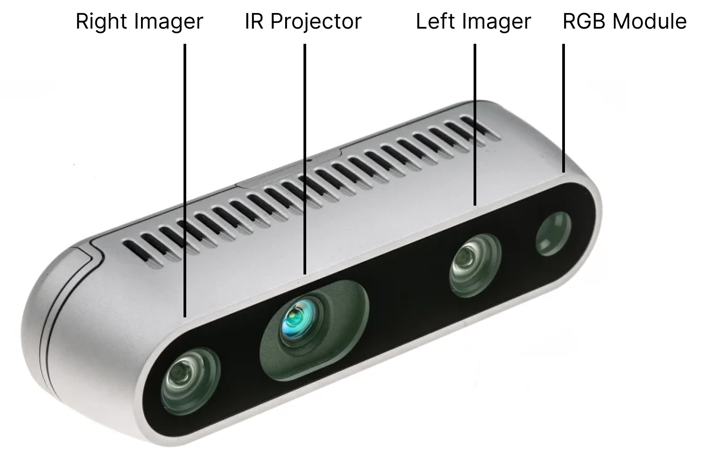

# Realsense Camera

The Realsense D435 camera offers RGB and depth image capabilities.



## Setup

1. Clone the repository correct repository. The code is based from [this repository](https://github.com/iory/docker-ros-realsense).

If you have the Realsense D435 camera use:
```bash
git clone git@github.com:ReconCycle/ros-realsense.git
```

If you have the Realsense D405 camera use:
```bash
git clone git@github.com:ReconCycle/ros-realsense-d405.git
```

2. Change `ROS_MASTER_URI` and `ROS_IP` in the docker-compose.yml file. For example:

3. Run `docker-compose up -d`.

## Configuration

The Realsense camera has been configured to use the resolution of 720 x 1280. This is specified in [rs_camera.launch](https://github.com/ReconCycle/ros-realsense/blob/main/launch/rs_camera.launch).

To immediately sleep the camera, in the `docker-compose.yaml` use the command:

```yaml
command: bash -c "(sleep 10 && rosservice call /realsense/enable False) & roslaunch realsense2_camera rs_camera.launch enable:=false"
```
Otherwise:
```yaml
command: roslaunch realsense2_camera rs_camera.launch
```

## Calibration

The Realsense D435 camera comes pre-calibrated. This can be verified in the [Realsense Viewer](https://www.intelrealsense.com/sdk-2/). The calibration can be run from here as well.

Verify that the depth has been calibrated correctly. At Goettingen, the Realsense D435 camera is accurate to 3mm.

The intrinsic calibration may be improved by running the intrinsic calibration procedure.

### Intrinsic Calibration Procedure

1. Print a checkerboard from [calib.io](https://calib.io/pages/camera-calibration-pattern-generator). We use a 7x10 (the number refers to the number of internal corners on the grid) calibration board with each square measuring 20mm.
2. Take images of the calibration and different locations in x, y, z with the board at varying angles. Use the [image_saver.py](https://github.com/ReconCycle/vision_pipeline/blob/dev/image_saver.py) utility.
3. Use the intrinsic calibration file with the vision_pipeline.