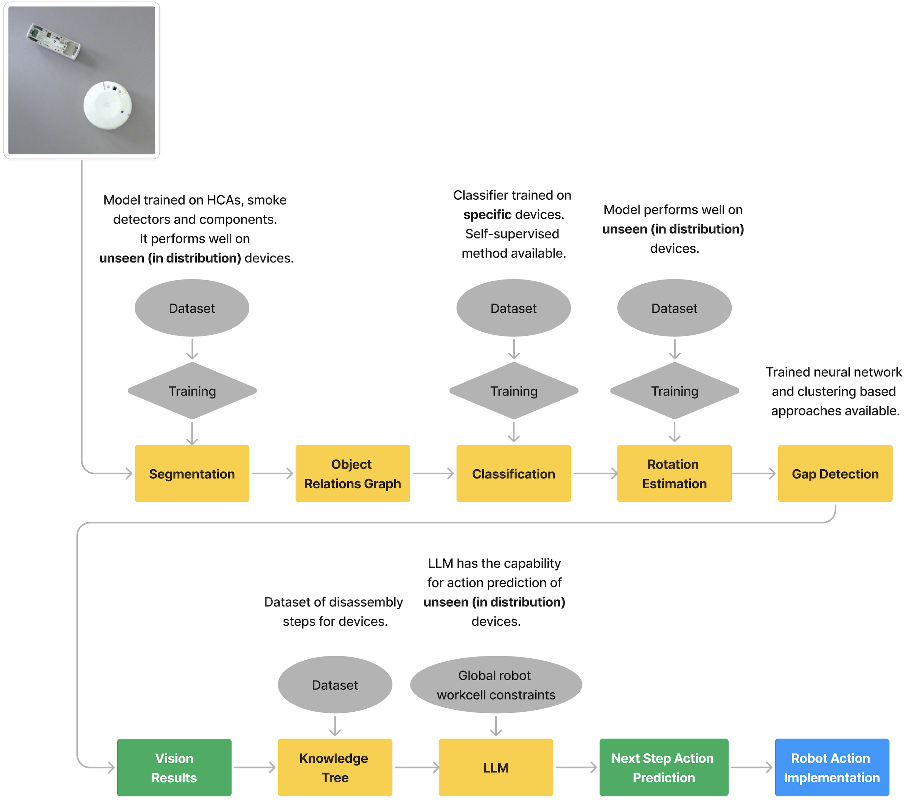
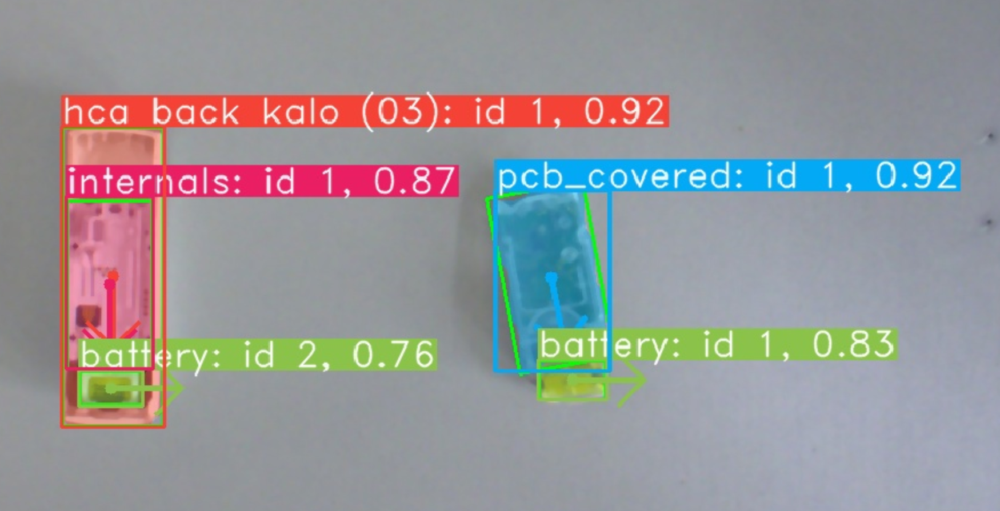
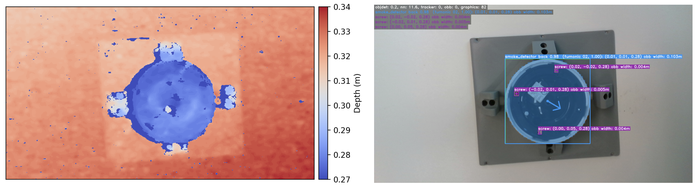
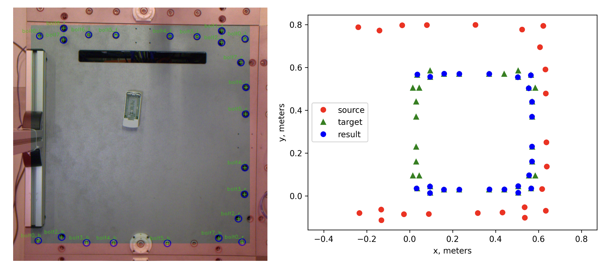
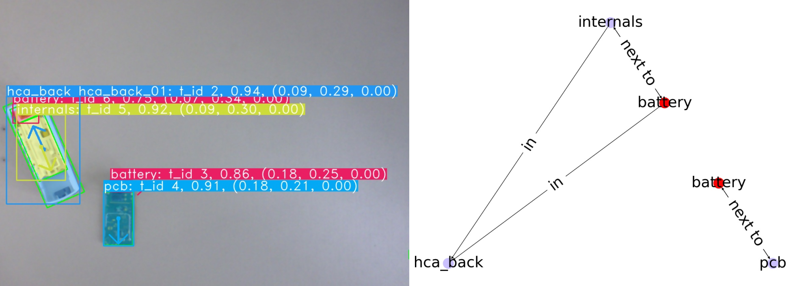
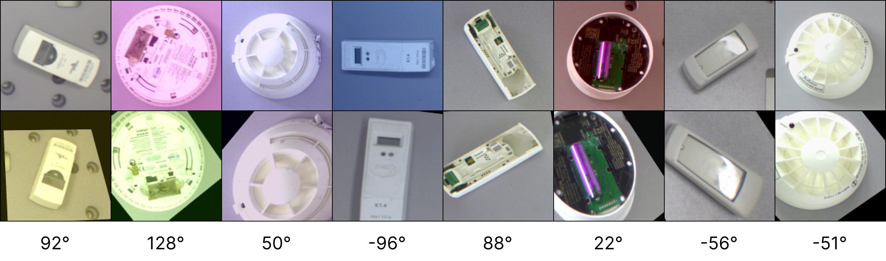
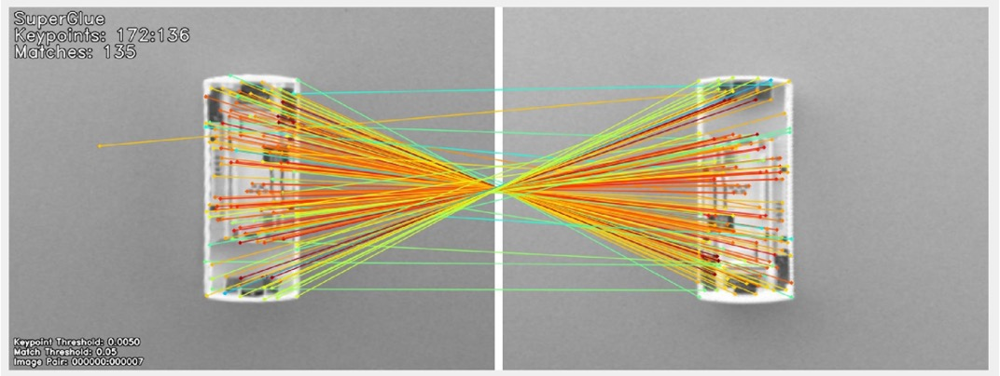
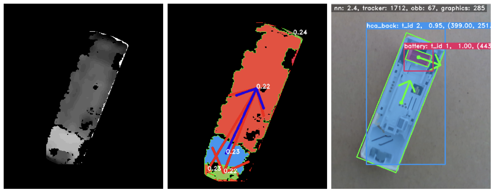

# Vision System Overview

An overview of the vision system and its general usage is covered in this manual.

The vision system serves as support for selecting appropriate actions during the disassembly process. This is enabled by detecting disassembly objects and their properties, which is used in the decision process.

The following chapters describe setup of the cameras and the vision pipeline, which decides which disassembly step or skill should be performed next.

<!-- ! CHAPTERS?? -->

## Vision Workflow

To determine the disassembly actions that lead to a successful device disassembly, the physical properties of the device need to be known. This is a difficult problem, and we limit it to the following set of properties: device pose detection, device classification, device component detection, and device gap detection.

The vision system workflow is shown in the following diagram. The system consists of multiple vision based methods for information extraction. The results of this is used for action prediction using LLMs and a knowledge tree. The predicted actions can then be performed by the robots in the Workcell.

### Segmentation Model for Pose Estimation

<!-- ADD IMAGE. -->

We use instance segmentation on the image together with some prior information about the objects. Instance segmentation detects objects on an image. For each object it provides a mask containing the object, a label and a confidence score.

We restrict the problem to the case where the camera is looking down on the scene containing objects of interest, and where the surface the objects are on is perpendicular to the camera. This applies for a fixed camera above the scene and a camera mounted to the robot end-effector. In both cases we know the position of the camera. Given the height of the objects, we can get an estimate of the 6D pose of the objects from the segmentation. Using an RGBD camera we can get the distance of the objects to the camera, and therefore also the depth. Using an RGB camera, we can use a prior height estimate of the objects.

The instance result contains a segmentation mask and classification for each object. From the segmentation mask we can extract object position, bounding box, oriented bounding box and rotation. The position is the centre of the mask. The bounding box is the smallest rectangle that fits the mask where the rectangle is not rotated but aligned with the image. The oriented bounding box is the smallest rotated rectangle that fits the mask.

The rotation of an object is harder to compute. For an HCA, given the oriented bounding box, the rotation is the angle of the long side with the horizontal. Since HCAs have a 180 degree rotation invariance, we use features of the device to define the rotation. Namely, if there is a battery detected in the device, the rotation is chosen that is in the direction of the battery. The rotation for the smoke detectors cannot be obtained in the same way because the smoke detectors are largely cylindrical. This is further discussed in the rotation estimation section.

### Image Coordinates to Real-World Coordinates

The instance segmentation gives us the positions relative to the image, in pixel coordinates. We need to find the positions in real-world coordinates. For the RGBD camera, we use the depth information and camera intrinsics to determine the real-world coordinates.

The Realsense camera is mounted to the robot end-effector. The position of the camera relative to the end-effector is known, and obtained from eye-in-hand calibration. The Realsense camera is calibrated and the depth data is aligned to the RGB image. The depth data gives us the depth information for each pixel. Given the RGB camera intrinsics and the depth value for a pixel coordinate, we can get the real-world coordinate relative to the camera using the function from the Realsense SDK.

For the RGB camera we apply a pixel to real-world coordinate transform by grounding the position of the objects to the work surface, which has a fixed size.

Point set registration is used for bolt matching. The 'source' is the input bolts, scaled up. The 'target' is the ground truth bolt locations. The 'result' is the source bolts fitted onto the target bolts.

### Object Relations Graph

We create a graph of relations from the segmentation result. The relations in the graph are `next to' and `inside'. An example is shown in \autoref{img:graph_relations_example}. These relations are useful to have because each connected component in the graph can be assumed to also be connected in the real world. It solves the problem of which objects belong to which device.

The graph representation is used for filtering out invalid detections. It is used for LLM prompt creation by translating the graph into natural language format.

### Classification

The segmentation model is trained on classes including 'HCA' and 'smoke detector'. It does not however predict the specific HCA or smoke detector type. This done purposefully such that the segmentation model does not need to be retrained for every new HCA or smoke detector. Instead, we train a classifier on the specific HCA and smoke detector classes.

The classification model achieves 100% prediction accuracy on the test set.

### Rotation Estimation

We train SuperGlue, a feature matching neural network, to predict the rotational difference between pairs of images, under a random homography. Under the hood the neural network finds keypoints and descriptors on the image pairs and learns to match them. An example of the input pairs:

An example of the matches between two devices:

In the real-world implementation, predicting the homography for finding the rotation is too strict. It can be the case that we have very few matched keypoints that are returned by SuperGlue. In this case, estimating the homography and extracting the rotation from this will lead to a bad prediction. This is because estimating the homography requires many keypoints to deliver a good estimation.

Instead of estimating the homography we estimate a 2D affine transform between the two sets of keypoints, where the rotation is around the centre of the image. This allows rotation estimation given few keypoint pairs.

To make the rotation estimation robust to false predictions we apply a median filter. This filter is applied over the last few frames. For this tracking of the objects is required.

### Tracking

We use a 2D Kalman Filter for object tracking. Each object is identified between frames based on its class and position. The tracking is used to assign IDs for component that are stable over multiple image frames. It is also necessary to identify an object to apply filtering for rotation prediction.

### Gap Detection

To disassemble some devices, a levering operation is required. This operation requires inserting a screwdriver or similar into a gap, and by using the fulcrum effect on the housing, an internal component can be removed, for example the PCB.

To perform levering actions autonomously with a robot, it is first necessary to find gaps in the device. We use a Realsense camera that provides RGB and depth information. We use the HDBSCAN algorithm to cluster the depth image and find large height changes in the depth data that we describe as a gap.

The **blue** arrow in the above figure represents a valid gap with levering direction.