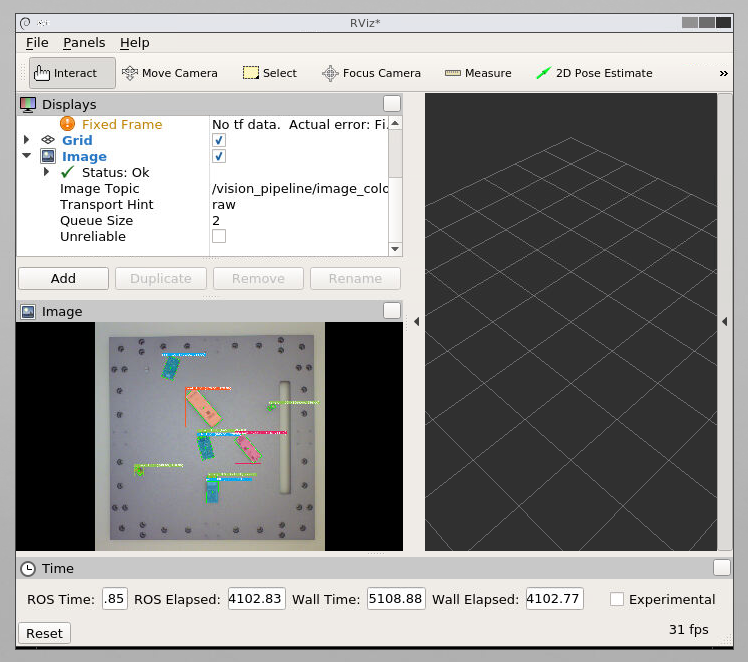

# Vision Pipeline

Vision pipeline utilizes information obtained through camera sensors to select the appropriate action during the disassembly process.

Docker container that offers GPU support and a configured python environment for [vision-pipeline](https://github.com/ReconCycle/vision-pipeline) and [action-predictor](https://github.com/ReconCycle/action_predictor).



<!-- TODO add user guides, method overviews etc.-->

## Usage

Set the parameters you want in `config.yaml`.

Run example:
```
python ros_pipeline.py
```

To enable the pipeline for realsense or basler use:
```
rosservice call /vision/realsense/enable True
```
or
```
rosservice call /vision/basler/enable True
```

**Publishes**:

Basler:

- `/vision/basler/colour`, Image
- `/vision/basler/detections`, ROSDetections
- `/vision/basler/markers`, MarkerArray
- `/vision/basler/poses`, PoseArray

Realsense:

- `/vision/realsense/colour`, Image
- `/vision/realsense/detections`, ROSDetections
- `/vision/realsense/markers`, MarkerArray
- `/vision/realsense/poses`, PoseArray
- `/vision/realsense/gaps`, ROSGaps
- `/vision/realsense/cluster`, Image
- `/vision/realsense/mask`, Image
- `/vision/realsense/depth`, Image
- `/vision/realsense/lever`, PoseStamped

**Services**:

- `/vision/basler/enable` True/False
- `/vision/realsense/enable` True/False
- `/vision/vision_get_detection` VisionDetection.srv (from [context_action_framework](https://github.com/ReconCycle/context_action_framework))

The `/vision/vision_get_detection` service provides a single stable detection result from the requested camera.

For example, to get one Basler detection, run:

```
rosservice call /vision/vision_get_detection 0 False
```
To get a Realsense detection, run:
```
rosservice call /vision/vision_get_detection 1 True
```
where True provides the gaps as well.

** Camera Services:**

- `rosservice call /basler/set_sleeping` True/False
- `rosservice call /realsense/enable` True/False


